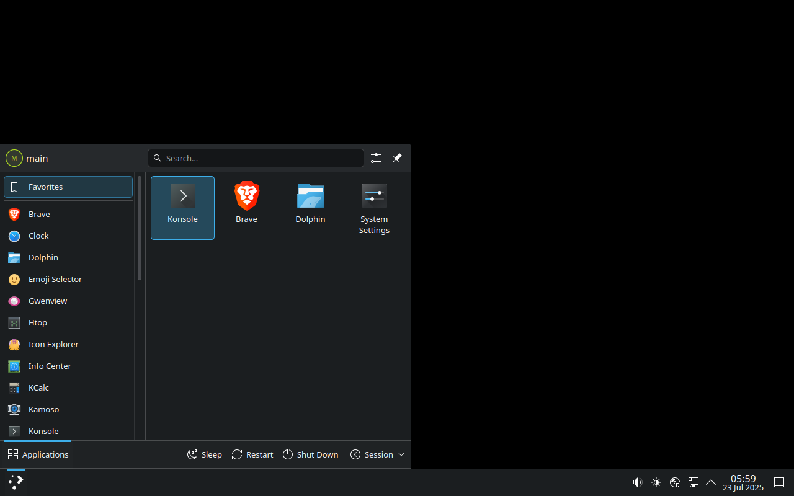

# Easy Arch Linux


<table width="100%">
<thead>
<tr><th align="left">🚧 UNDER CONSTRUCTION</th></tr>
</thead>
<tbody>
<tr><td>

This is a year-old, neglected, poorly put-together project that is undergoing a massive overhaul. Nothing works correctly yet, so please come back later.

</td></tr>
</tbody>
</table>


Easy Arch Linux is a lightweight, Arch-based distribution that stays close to upstream. It's built for ease of installation, allowing users to quickly set up and reproduce their development environment. It starts off stable, with the option to easily update to a rolling release using `sudo pacman -Syu`.

It comes with only the essential packages needed for any system. The desktop environment is a stripped-down, minimal version of KDE Plasma, designed to stay out of your way and let you get straight to work.  
**No bloat. No distractions.**



## 💽 How to Install Easy Arch Linux

1. **Download the ISO**  
   The ISO is hosted on **Google Drive** (GitHub does not allow files larger than 2 GB).
   
   **📥Link: [https://drive.google.com/file/d/18nclTLo05_KU7uOfYd_WTnI0LK--mGE6/view?usp=sharing](https://drive.google.com/file/d/18nclTLo05_KU7uOfYd_WTnI0LK--mGE6/view?usp=sharing)**

3. **Create a Bootable USB**  
   Use one of the following tools to write the ISO to a USB drive:
   - **[balenaEtcher](https://etcher.balena.io/)** (Windows/macOS/Linux)
   - **[Rufus](https://rufus.ie/en/)** (Windows only)
   - Or use the `dd` command (Linux/macOS):
     ```bash
     sudo dd if=easy_archlinux-2025.07.28-x86_64.iso of=/dev/sdX bs=4M status=progress && sync
     ```
     ⚠️ Replace `/dev/sdX` with your actual USB device (this will erase the disk).

4. **Boot from USB**  
   Reboot your machine and use your **BIOS/UEFI boot menu** to boot from the USB drive.

5. **Live Environment and Installation**  
   The ISO boots into a live session. A terminal window (Konsole) will appear, offering to begin disk installation.  
   You can either:
   - Use the live environment temporarily  
   - Or start the installation immediately by following the terminal prompts

## 🧰 How to Compile Easy Arch Linux

You can clone this repository and compile the ISO yourself. This needs an
internet connection to download every component that goes into the ISO.

Packages are pulled at their latest version, so the ISO you build may contain
bugs the pre-built download does not (that one was briefly examined before being
uploaded).

**Build with Docker.** The ISO is assembled with `mkarchiso`, which resolves the
ISO's package list against the build host's Arch Linux repositories. That means
the build only works on a genuine Arch userland with the real Arch `core`,
`extra`, and `multilib` repos. On anything else — Manjaro, EndeavourOS, Ubuntu,
Fedora, macOS, Windows — those repos are wrong or missing and the build fails
with errors like `target not found: archinstall` or endless kernel-provider
prompts.

Docker sidesteps all of that: the image is `archlinux:latest`, so the build runs
inside real Arch no matter what machine you are on. **Follow the steps for your
OS to install Docker, then the shared build steps are identical everywhere.**

### 🐧 Linux

1. **Install Docker and Git** using your distro's package manager, for example:
   - Arch-based: `sudo pacman -S --needed docker git`
   - Debian/Ubuntu: `sudo apt update && sudo apt install docker.io git`
   - Fedora: `sudo dnf install docker git`
2. **Start the Docker service**
   ```
   sudo systemctl enable --now docker
   ```
3. Continue with **[Build the ISO](#-build-the-iso-all-platforms)** below.

### 🍎 macOS

1. **Install [Docker Desktop for Mac](https://www.docker.com/products/docker-desktop/)** and launch it (wait until the whale icon says Docker is running).
2. **Install Git** if you don't have it — it ships with the Xcode command line tools:
   ```
   xcode-select --install
   ```
3. Continue with **[Build the ISO](#-build-the-iso-all-platforms)** below.
   (On macOS you can drop the `sudo` in front of the `docker` commands.)

### 🪟 Windows

1. **Open PowerShell as Administrator and install WSL2**
   ```
   wsl --install
   ```
   Reboot if prompted.
2. **Install [Docker Desktop for Windows](https://www.docker.com/products/docker-desktop/)**, then in its settings enable **"Use the WSL 2 based engine"**.
3. **Open your WSL distro** (e.g. Ubuntu from the Start menu) and confirm Docker works:
   ```
   docker --version
   ```
4. **Install Git inside WSL**
   ```
   sudo apt update && sudo apt install git
   ```
5. Continue with **[Build the ISO](#-build-the-iso-all-platforms)** below, running the commands **inside your WSL terminal**. (With Docker Desktop you can usually drop the `sudo`.)

### 🐋 Build the ISO (all platforms)

Once Docker is installed and running, the steps are the same everywhere.

1. **Clone the repository and enter it**
   ```
   git clone https://github.com/devbyte1328/easy-arch-desktop-iso.git
   cd easy-arch-desktop-iso
   ```

2. **Build the Docker image** (creates the Arch build environment)
   ```
   sudo docker build -t easyarch .
   ```

3. **Compile the ISO.** `--privileged` is required — `mkarchiso` mounts
   `proc`/`sys`/`dev` and uses loop devices. The finished ISO is written to an
   `out/` folder in the current directory, and downloaded packages are kept in a
   `cache/` folder so re-runs don't re-download several GB every time.
   ```
   sudo docker run --rm -it --privileged \
     -v "$PWD/out:/build/output/out" \
     -v "$PWD/cache:/build/cache" \
     easyarch
   ```

4. **Collect the ISO.** After the build finishes, the ISO is in `out/`:
   ```
   ls out/
   ```
   - **Windows (WSL):** the same folder is reachable from File Explorer at
     `\\wsl$\<distro>\home\<your-username>\easy-arch-desktop-iso\out`.

5. **(Optional) Save a full build log** for debugging:
   ```
   sudo docker run --rm -t --privileged \
     -v "$PWD/out:/build/output/out" \
     -v "$PWD/cache:/build/cache" \
     easyarch 2>&1 | tee build.log
   ```

> 💡 The build downloads several GB of packages. The `-v "$PWD/cache:/build/cache"`
> mount keeps those downloads on your machine between runs, so a rebuild only
> fetches what changed instead of everything again.
